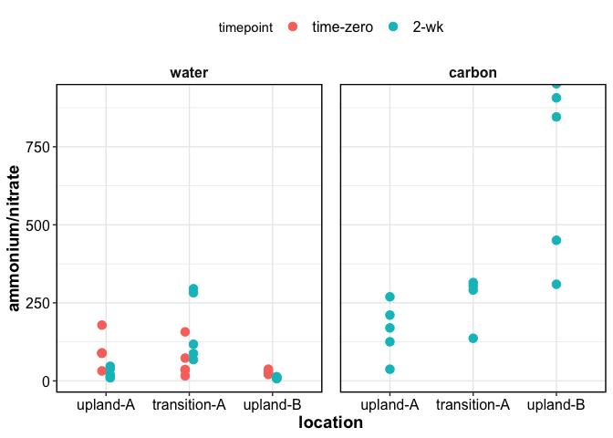
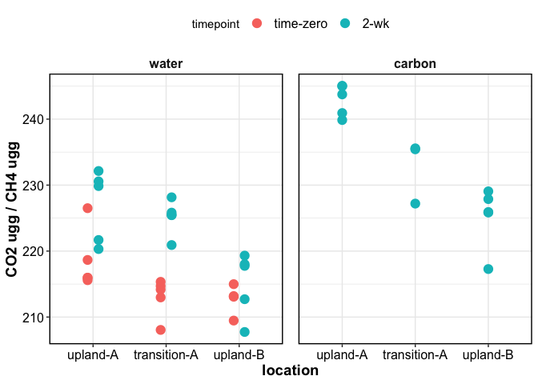

------------------------------------------------------------------------

How do nutrient limitations influence redox transformations?  
Our objective is to better understand mechanistic controls on temporal
progression of redox conditions.  
Specifically, how does (a) organic carbon (C) or nutrient availability
(N, S, P) and (b) salinity influence time to anoxia and the progression
of redox conditions?

We prepared mesocosms in 50-mL centrifuge tubes (10 g soil + filled with
water) and incubated for various durations ranging from 1 hr to 2 weeks.
At the end of the incubation, the mesocosms were opened in an anaerobic
glovebox and sampled for various analyses (tracking transformations in
redox sensitive elements).

Measure \[NO3\]/\[NH4\], \[Fe2\]/\[Fe3\], \[SO4\]/\[HS\],
\[CO2\]/\[CH4\] in the water extracts to determine the time scale for
the different redox reactions.

- dissolved ions (NH4, NO3, Ca, Mg, Na, Cl, SO4)
- dissolved organic carbon
- dissolved CO2 and CH4
- extractable Fe2, Fe3

all analyses were performed on the water “extract”, except for Fe2/3,
which was obtained using 0.5M HCl extractions on the soil pellet.

------------------------------------------------------------------------

## Initial results

    ## $optode_ts

<!-- -->

    ## 
    ## $optode_firesting

<!-- -->

    ## $gg_weoc

<!-- -->

    ## 
    ## $gg_iron

<!-- -->

    ## 
    ## $gg_iron_ratio

<!-- -->

    ## 
    ## $gg_nitrogen

<!-- -->

    ## 
    ## $gg_nitrogen_ratio

<!-- -->

    ## 
    ## $gg_sulfur

<!-- -->

    ## 
    ## $gg_sulfur_ratio

<!-- -->

    ## 
    ## $gg_ghg

<!-- -->

    ## 
    ## $gg_ghg_ratio

<!-- -->

    ## 
    ## $gg_orp

<!-- -->

------------------------------------------------------------------------

## Session Info

Session Info

Date run: 2023-10-23

    ## R version 4.2.1 (2022-06-23)
    ## Platform: x86_64-apple-darwin17.0 (64-bit)
    ## Running under: macOS Big Sur ... 10.16
    ## 
    ## Matrix products: default
    ## BLAS:   /Library/Frameworks/R.framework/Versions/4.2/Resources/lib/libRblas.0.dylib
    ## LAPACK: /Library/Frameworks/R.framework/Versions/4.2/Resources/lib/libRlapack.dylib
    ## 
    ## locale:
    ## [1] en_US.UTF-8/en_US.UTF-8/en_US.UTF-8/C/en_US.UTF-8/en_US.UTF-8
    ## 
    ## attached base packages:
    ## [1] stats     graphics  grDevices utils     datasets  methods   base     
    ## 
    ## other attached packages:
    ##  [1] PNWColors_0.1.0     soilpalettes_0.1.0  googlesheets4_1.0.1
    ##  [4] lubridate_1.9.2     forcats_1.0.0       stringr_1.5.0      
    ##  [7] dplyr_1.1.0         purrr_1.0.1         readr_2.1.4        
    ## [10] tidyr_1.3.0         tibble_3.1.8        ggplot2_3.4.3      
    ## [13] tidyverse_2.0.0     tarchetypes_0.7.2   targets_0.14.0     
    ## 
    ## loaded via a namespace (and not attached):
    ##  [1] tidyselect_1.2.0  xfun_0.37         gargle_1.2.0      colorspace_2.0-3 
    ##  [5] vctrs_0.5.2       generics_0.1.3    htmltools_0.5.3   yaml_2.3.5       
    ##  [9] utf8_1.2.2        rlang_1.1.1       pillar_1.8.1      glue_1.6.2       
    ## [13] withr_2.5.0       lifecycle_1.0.3   munsell_0.5.0     gtable_0.3.0     
    ## [17] cellranger_1.1.0  evaluate_0.16     codetools_0.2-18  labeling_0.4.2   
    ## [21] knitr_1.42        fastmap_1.1.0     callr_3.7.2       tzdb_0.3.0       
    ## [25] ps_1.7.1          fansi_1.0.3       highr_0.9         scales_1.2.1     
    ## [29] backports_1.4.1   farver_2.1.1      fs_1.5.2          hms_1.1.2        
    ## [33] digest_0.6.29     stringi_1.7.8     processx_3.7.0    grid_4.2.1       
    ## [37] cli_3.6.0         tools_4.2.1       magrittr_2.0.3    base64url_1.4    
    ## [41] pkgconfig_2.0.3   ellipsis_0.3.2    data.table_1.14.4 timechange_0.2.0 
    ## [45] googledrive_2.0.0 rmarkdown_2.21    rstudioapi_0.14   R6_2.5.1         
    ## [49] igraph_1.3.4      compiler_4.2.1

